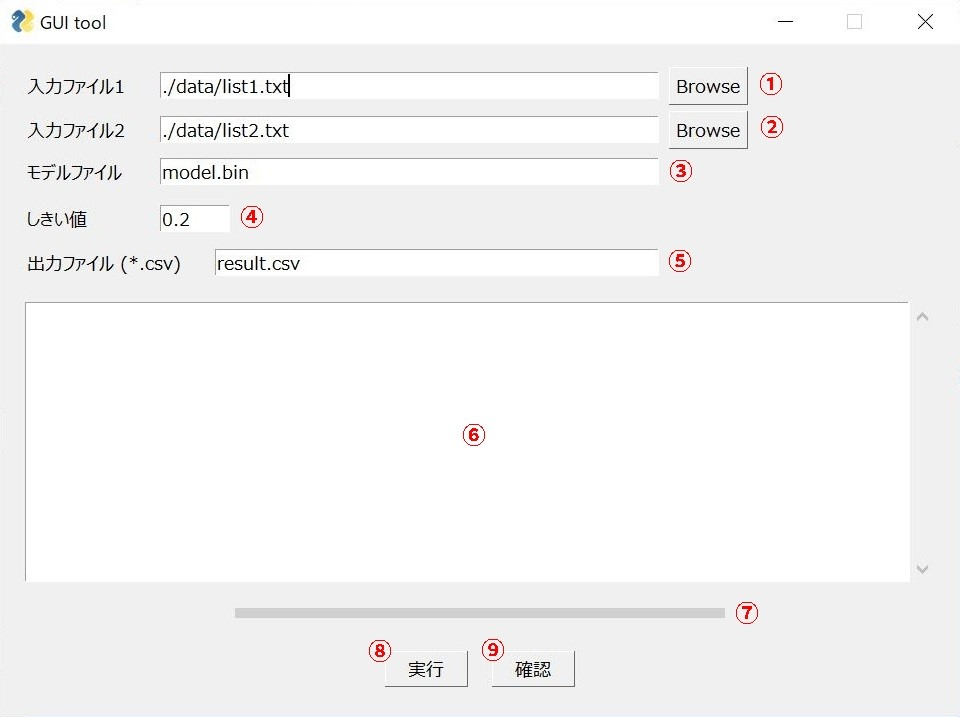
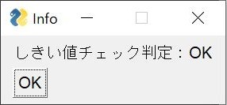

2文の類似度を算出するプログラム
====

gensim (Word2Vec) を活用して、2文の類似度を算出するPythonスクリプトです。  
GUIには[PySimpleGUI](https://pysimplegui.readthedocs.io/en/latest/)のtkを利用しています。

## Description
2つのテキスト形式のファイルをプログラムに渡すと、1文ずつ類似度の比較を行います。  

例えば、  
test1.txt
```test1.txt
文1
文2
文3
```
test2.txt
```test.txt
文4
文5
文6
```
という2種類のテキストファイルが与えられた時、文1-文4, 文1-文5, 文1-文6, 文2-文4, 文2-文5, ... , 文3-文6といった様に、2つのテキストに含まれる各文の類似度を総当りで算出します。  

類似度について、ある一定の値を超える文のペアがあるかどうかを判定するしきい値を設定することができます。  

また、結果は「類似度, 文, 文」という形でcsvとして出力可能です。  

使い道としては、例えば1つ目のテキストファイルに講義課題で提出された自由レポートのタイトル名を、2つ目のテキストファイルに過去に提出されたレポートのタイトル名を列挙しておくことで、盗作判定を行うことができます。

## How to Use
gui_tool.pyを実行すると、下記の画面が表示されます。  
<div align="center"></div><br />  

**①ファイル1選択**  
入力に使用する1つ目のテキストファイルを、相対パスまたは絶対パスで指定してください。  
「Browseボタン」を押すと、ファイルエクスプローラが立ち上がりますので、そちらでファイルを選択すると自動的に絶対パスが入力されます。  
指定されたファイルが存在しない場合はエラーになります。  

**②ファイル2選択**  
①と同様のため割愛。  

**③モデルファイルの設定**  
word2vecの学習モデル（バイナリファイル）を相対パスまたは絶対パスで指定して下さい。  
デフォルトでは実行プログラムと同じフォルダに model.bin が置かれていることを想定し設定されています。指定されたファイルが存在しない場合はエラーになります。  
お試し利用であれば、[こちら](https://qiita.com/Hironsan/items/513b9f93752ecee9e670)で公開されているモデルが良いと思います。（※ただし左記はvec形式のファイルのため、予めbinファイルに変換しておく必要があります）

**④しきい値設定**  
類似度のしきい値を設定する場所です。ここで設定された値以上の類似度の文がある場合には、⑥のコンソールエリアとファイルの末尾に「OK」と出力されます。  
数値は半角数字で入力して下さい。デフォルトでは0.2が設定されています。  

**⑤出力ファイル設定**  
結果を出力するcsvファイル名を指定して下さい。既に指定されたcsvファイルが存在する場合は上書きされます。デフォルトではresult.csvが設定されています。  

**⑥コンソールエリア**  
プログラムの実行が終了すると、出力ファイルに出力される内容と同じ内容がこちらのコンソールに表示されます（順番は類似度でソート）。  
プログラムを再度実行した場合は、こちらのコンソールはリセットされます。  

**⑦プログレスバー**  
プログラムの実行進捗を表すプログレスバーです。どの程度解析が進んでいるかを視覚的に把握することができます。  
以下はプログラムの解析が進んでいるときのバーの例です。  

<div align="center"></div><br />  

**⑧実行ボタン**  
実行ボタンを押すと、プログラムの実行を行います。実行が完了すると、ポップアップで完了メッセージが表示されます。  
プログラム実行中は、再度実行のボタンを押しても実行することができません。  

**⑨確認ボタン**  
確認ボタンを押すと、直前に実行したデータと現在しきい値で設定されている値とで類似度のしきい値チェックを実施します。（コンソールエリアと出力ファイルの更新は実施しません）。  
結果はポップアップで表示されます。  

<div align="center"></div><br />  

## Requirement
* gensim 4.0.1
* mecab-python3 1.0.4
* numpy 1.22.2
* pysimplegui 4.57.0
* scipy  1.7.3

## Example  
下記は実行結果例です。学習モデルはこちらを利用。  
Input: text1.txt
```text1.txt
昨日は好物のカレーを食堂で食べた
```  
Input: text2.txt
```text2.txt
僕は昨日食堂でカレーを食べた
明日の天気は曇のち晴れとなっています
美術館に飾られたその絵はとても綺麗だった
```  

Output: result.csv  
```result.csv
0.95,昨日は好物のカレーを食堂で食べた,僕は昨日食堂でカレーを食べた
0.42,昨日は好物のカレーを食堂で食べた,美術館に飾られたその絵はとても綺麗だった
0.39,昨日は好物のカレーを食堂で食べた,明日の天気は曇のち晴れとなっています
```  

## Author

[nekunet](https://github.com/nekunet)